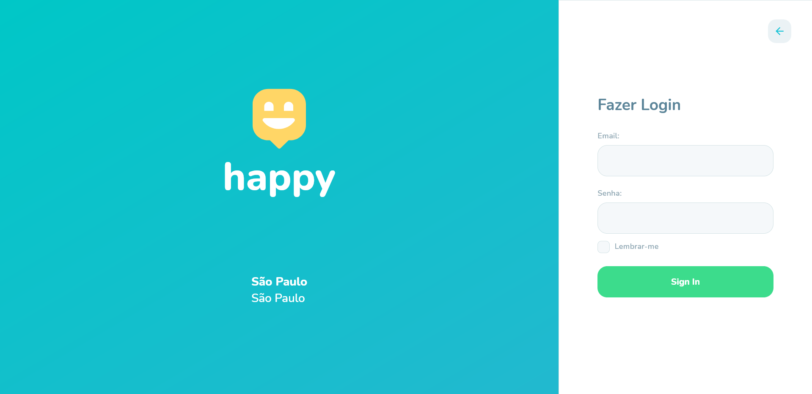

<h1 align="center">🚀 NLW3 Happy</h1>
<p align="center">☕ Projeto desenvolvido durante a terceira edição da NLW que consiste em cadastro e visualização de informações sobre casas de acolhimento institucional</p>

## 💬 Sobre o projeto 
Projeto responsável pela criação e visualização de informações sobre casas de acolhimento institucional, com o objetivo de conectar pessoas à casas de acolhimento institucional.

- Possibilita o cadastro de novas casas de acolhimento institucional
- Acesse informações como horários, fotos, local e dias de funcionamento
- Veja as localizações através do mapa

<p align="center">
    
    
</p>

## 🛠 Tecnologias usadas

- [Node.js](https://nodejs.org/en/)
- [Yarn](https://yarnpkg.com/)
- [React](https://reactjs.org)
- [React Native](https://facebook.github.io/react-native/)
- [TypeScript](https://www.typescriptlang.org/)
- [Expo](https://expo.io/)
- [TypeORM](https://typeorm.io/#/)
- [Express](https://expressjs.com/)
- [jsonwebtoken](https://github.com/auth0/node-jsonwebtoken)

## ⚙️ Como rodar a aplicação

Clone este repositório

```bash

$ git clone https://github.com/Felipe-Macario/nlw3-happy.git

```

Tenha certeza de executar o Backend antes das outras aplicações

### 💡 Backend

Edite o IP do arquivo **backend/src/views/images_view.ts** para o IP interno do seu computador.

```bash
# Navegue até a pasta backend
$ cd backend

# Instale as dependências
$ yarn install

# Rode as migrations
$ yarn typeorm migration:run

# Execute a aplicação em modo de desenvolvimento
$ yarn dev
```

O servidor iniciará na porta 3333, para acessar a aplicação utilize a url [`http://localhost:3333`](http://localhost:3333)

### 🌐 Web

### Mapbox

- Usando o arquivo chamado ".env.example" na pasta raiz da web como exemplo, crie um arquivo ".env" no mesmo local e coloque uma variável chamada "REACT_APP_MAPBOX_TOKEN" ou apenas renomeie o ".env.example" para ".env"
- Crie ou entre em sua conta do [Mapbox](https://www.mapbox.com/)
- Copie seu token do [Mapbox](https://account.mapbox.com/)
- Mude o valor de "REACT_APP_MAPBOX_TOKEN" dentro do arquivo ".env" para o seu token do Mapbox

```bash
# Navegue até a pasta web
$ cd web

# Instale as dependências
$ yarn install

# Execute a aplicação em modo de desenvolvimento
$ yarn start
```

A aplicação será executada na porta 3000, para acessar a aplicação utilize a url [`http://localhost:3000`](http://localhost:3000)

### 📱 Mobile

Edite o IP do arquivo **mobile/src/services/api.ts** para o IP interno do seu computador.

### Expo

- Instale o **Expo CLI** com o comando `yarn global add expo-cli`
- Instale o **Expo** em seu celular.

```bash
# Navegue até a pasta mobile
$ cd mobile

# Instale as dependências
$ yarn install

# Execute a aplicação em modo de desenvolvimento
$ yarn start
```

A aplicação será executada na porta 19002, para acessar a aplicação utilize a url [`http://localhost:19002`](http://localhost:19002)

- Será aberto uma página no navegador com um **QR CODE**, leia-o com o aplicativo do **Expo**

### ⛽ Adicionais

- Implementei autenticação na Web usado JWT Token

## 🚕 Créditos

- Projeto seguindo a orientação de [Rocketseat](https://rocketseat.com.br/)
- Versão Web do layout no [Figma](https://www.figma.com/file/mDEbnoojksG4w8sOxmudh3/Happy-Web)
- Versão Mobile do layout no [Figma](https://www.figma.com/file/X27FfVxAgy9f5IFa7ONlph/Happy-Mobile)

## 📄 Licença

Esse projeto está sob a licença MIT. Veja o arquivo [LICENSE](LICENSE.md) para mais detalhes.